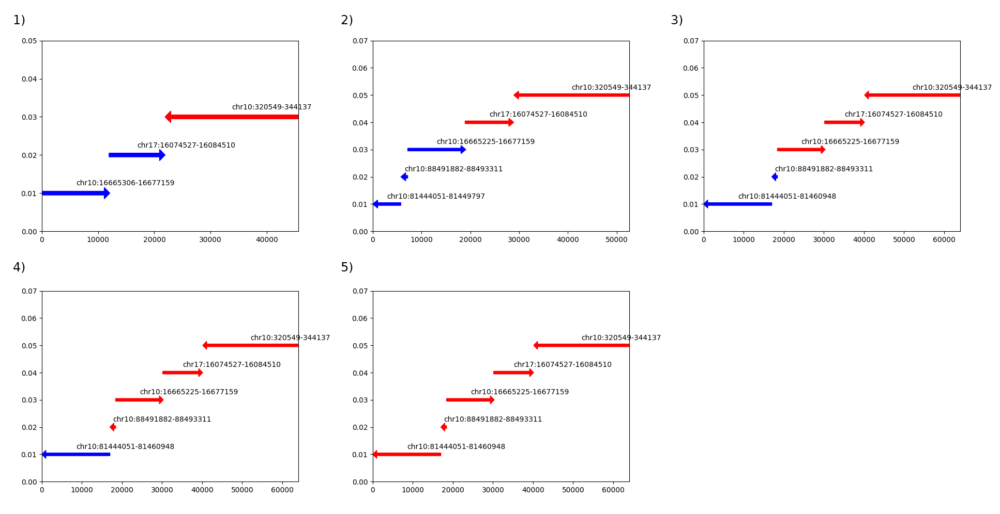
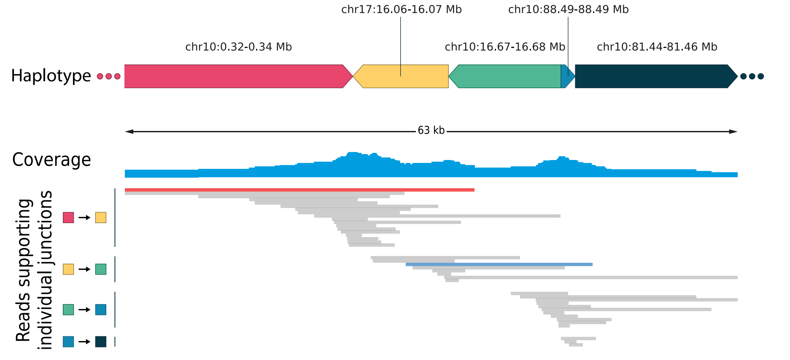

# sv_assemblies
Making assemblies from structural variants (SVs) supporting reads and iteratively connecting close SVs

This is still work in progress and the functionality is currently split across two hard-coded scripts with partial outdated code. In the future this workflow will be combined and sample input via command line parameters will be added.

## sv_subassemblies.py

1. Gathers supporting reads from one single SV
2. Assembles reads with lamassemble and prunes ends with coverage below 2
3. Maps assembly to reference and detects mappings region
4. Starts iterative elongation of the assembly by starting the assemble_sv function from assemble_structural_variants.py with the "best" mapping region

## assemble_structural_variants.py

Main functionality: gathers and assembles reads and calls SVs from assemblies. Save intermediate read and assembly data and visualizes data

1. Gathers reads from spanning at least one of the SVs of this run
2. Assembles reads with lamassemble and prunes ends with coverage below 2
3. Maps assembly to reference, detects mappings region and adds new SVs to this run
4. Cycles to (1)

**Figure 1:** Interative assembly connects multiple regions conntected by SVs on one haplotype. Cycles 1-6 of the SV assembly progress are shown. Regions completed by the script are shown in red.

**Figure 2:** Iterative assembly of nanopore reads connects multiple SVs directly. The iterative process of read selection, assembly and SV calling is depicted with groups of reads initially selected as supporting of one single translocation (indicated by two colored boxes on the left). As the resulting assembly elongates, new translocations are detected leading to selection of a new batch of reads. Exemplary reads connecting more than one SV are colored red and blue.
